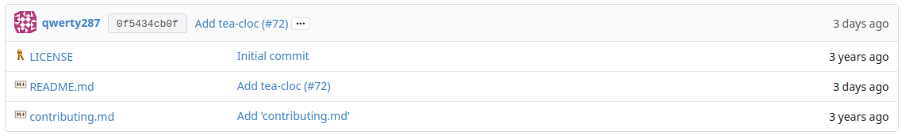

# Gitea VS-Code Icons 

[](https://www.gnu.org/licenses/gpl-3.0)

Browser extension to use [vscode-icons](https://github.com/dderevjanik/github-vscode-icons) in gitea repositories using [vscode-icons-js](https://github.com/dderevjanik/vscode-icons-js)

## Screenshot


## Building

To build run
```
npm run build:all
```
The build folder will contain the packaged extensions.

These are all the available npm run commands:
```
    "dev": "mkdir dist; npm run manifest:FIREFOX; webpack -w --mode development",
    "build:all": "npm run build:firefox; npm run build:chrome",
    "build:all:clean": "npm run build:firefox; npm run build:chrome; npm run clean",
    "build:firefox": "webpack --mode production; npm run manifest:FIREFOX; BROWSER=FIREFOX ts-node scripts/make-dist-zip.script.ts; npm run clean",
    "build:chrome": "webpack --mode production; npm run manifest:CHROME; BROWSER=CHROME ts-node scripts/make-dist-zip.script.ts; npm run clean",
    "manifest:FIREFOX": "BROWSER=FIREFOX ts-node scripts/manifest-gen.ts",
    "manifest:CHROME": "BROWSER=CHROME ts-node scripts/manifest-gen.ts",
    "clean": "rimraf ./dist",
    "clean:all": "rimraf ./build/*.zip; rimraf ./dist"
```
Note: To use "manifest:FIREFOX" and "manifest:CHROME" correctly, there must be a dist directory. 
## Optional: specify urls
You can specify urls in the "content_scripts" property of the manifest file.

The manifest file is generated by a ts script, "edit manifestChrome.ts" and "manifestFirefxo.ts".

The generated dist folder contains the unpacked extension.

## Installation
### Chrome/Chromium
To install in chrome/chromium you need to either create an extension package within the browser or using the .crx file in the "Releases" tab.
### Firefox
Open about:config and set the xpinstall.signatures.required option to false, then go to the addon page, click the gear an click "Install Add-on From File..."

#### Generated favicons with imagemagick
```
convert -resize 128x128 favicon.png favicon128.png
convert -resize 48x48 favicon.png favicon48.png
convert -resize 16x16 favicon.png favicon16.png
```

### Important note about vscode-icons-js
The original npm package lacks a couple of extensions, for this reason to compile the program it's better to manually install [this fork](https://github.com/Gamesmes90/vscode-icons-js) or else some files icons will be missing.

Note: The scripts to generate manifests and zip the extension are slightly modified versions of the scripts from [github-vscode-icons](https://github.com/dderevjanik/github-vscode-icons) 
